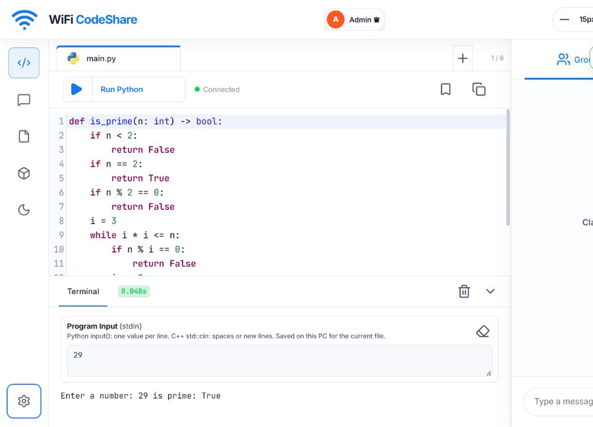
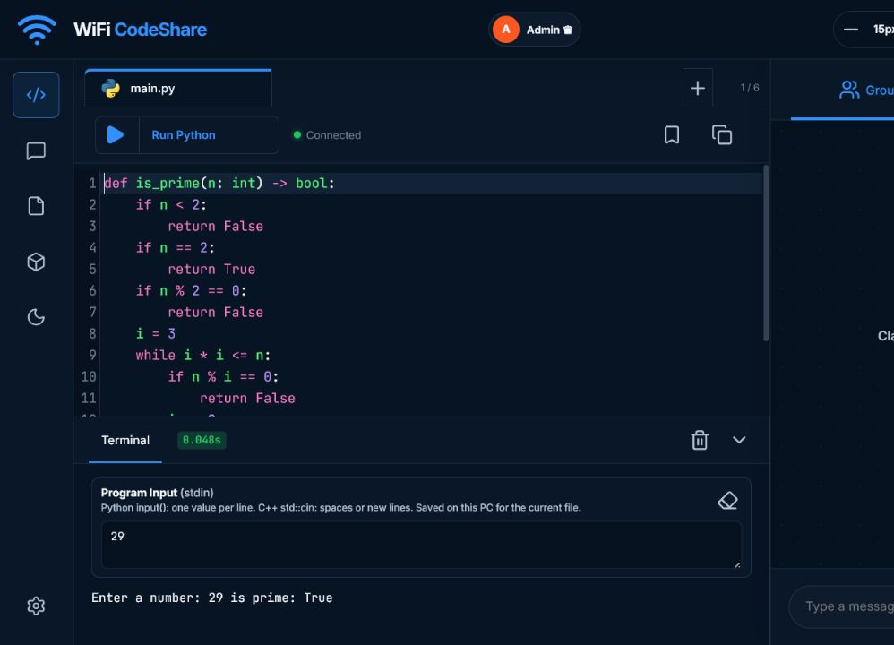
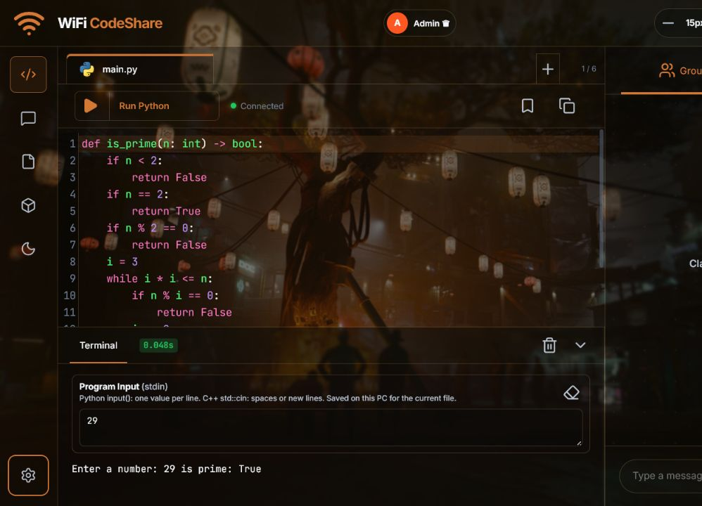

# Real-Time LAN Multiuser Code Editor

A real-time LAN code editor for Python and C++ with collaborative editing,
line ownership, Admin-approved Guest access, chat, appearance controls, and
host-side code execution. Changes, presence, messages, permissions, and file
updates are synchronized for connected users in real time.

## Version 4.1 — Interactive Input Terminal

Version 4.1 replaces the saved pre-run input box with a live terminal. Start a
Python or C++ program, respond when it asks for input, and continue entering
values one line at a time without restarting it. Output, errors, and prompts
stream into the terminal while the program is running, and a Stop button ends
the current user's process. Version 4.1 retains the Admin-approved Guest
workflow, collaboration, messaging, appearance system, and ownership fix from
Version 4.0.

Read the [changelog](CHANGELOG.md) for the complete feature history, detailed
changes, security notes, and previous releases.

> [!WARNING]
> **Use this project only on a trusted host computer and trusted local network.**
> It is intended for a class, lab, or small group working together with or
> without a lecturer. Do not expose the development server to the public
> internet or publish a populated `data` folder. Guest names, code, chats,
> snapshots, ownership, and permissions are stored locally as readable JSON.

> [!IMPORTANT]
> This is a collaborative prototype, not production authentication. It does
> not provide HTTPS, university SSO, encrypted storage, or a complete code-
> execution sandbox. Every person allowed to run code on the host must be
> trusted.

### Default light theme



### Default dark theme



### Dark theme with a fitted wallpaper



The wallpaper example uses **Fit**, **5% background dimming**, **98% wallpaper
visibility**, and **2px panel blur**. Wallpaper images and appearance settings
are saved only in the current browser on that PC and are not synchronized.

## Main features

- Live Admin approval or rejection of Guest join requests
- Real-time multi-file Python and C++ collaboration over a LAN
- Persistent line ownership, blank-line claiming, and code-access permissions
- Up to 15 Admin-configurable Python and C++ file tabs
- Live interactive terminal input, streamed output, Stop control, detailed
  errors, and restorable code snapshots
- Group Chat and Direct Messages with unread alerts, editing, and deletion
- One active session per approved Guest and Admin removal controls
- Adjustable full-screen workspace, terminal, chat, and Admin Settings panels
- Light, dark, and automatic themes with local wallpapers, Fill/Fit, adaptive
  colours, panel blur, dimming, visibility, and ambient backgrounds
- LAN address and QR-code sharing for trusted devices

## Quick start

### 1. Create an environment

Windows Command Prompt:

```cmd
python -m venv .venv
.\.venv\Scripts\activate.bat
```

macOS or Linux:

```bash
python3 -m venv .venv
source .venv/bin/activate
```

### 2. Install dependencies

```cmd
python -m pip install -r requirements.txt
```

### 3. Start the server

```cmd
python app.py
```

Open `http://localhost:8000` on the host. Trusted devices on the same LAN can
open the Wi-Fi address shown in CMD or scan the displayed QR code.

## Demonstration login

1. Select **Admin**, enter password `12345`, and log in.
2. On another browser or device, select **Guest**, enter a fictional full name
   such as `Bob`, choose a cursor colour, and send the request.
3. The Admin receives `Bob wants to join`. Open the notification or go to
   **Admin Settings → Join Requests**, then select **Accept** or **Reject**.
4. An accepted Guest enters automatically. Their approved identity is retained
   for future requests, and the Admin can remove it from Settings.

Only one active connection is allowed for each approved Guest identity.

### Change the Admin password

Set a private password in the same CMD window before starting the server:

```cmd
set "LIVE_EDITOR_ADMIN_PASSWORD=choose-a-new-admin-password"
python app.py
```

This is safer than editing the default value in `app.py` and avoids committing
a personal password to GitHub.

## Interactive terminal input

Select **Run Python** or **Compile & Run C++**. When the program asks for a
value, type it in the terminal input row and press `Enter` or select **Send**.
The program remains active for later prompts, just like a normal terminal.

For separate Python `input()` calls, send one value at each prompt:

```text
10
5
```

Entering `10 5` on one line gives the first Python `input()` call the complete
text. C++ `std::cin` accepts either `10 5` on one line or values on separate
lines. Each account can run one program at a time on the host. The safeguards
are 60 seconds per run, 100,000 output characters, 4,096 characters per input
line, 20,000 input characters per run, 20 active runs across the host, and four
simultaneous C++ compilations.

## C++ compiler and libraries

C++ compilation happens on the host; connected users do not need their own
compiler. The runner searches for `g++`, then `clang++`, and uses C++17. It was
tested with `g++`. Check the host from CMD:

```cmd
g++ --version
clang++ --version
```

To configure a compatible compiler executable manually:

```cmd
set "LIVE_EDITOR_CPP_COMPILER=C:\path\to\g++.exe"
python app.py
```

Microsoft `cl.exe` is not currently supported because it requires different
command options. Standard headers such as `<iostream>`, `<vector>`,
`<algorithm>`, and `<string>` work with the configured compiler.

> [!IMPORTANT]
> Third-party C++ libraries that need extra include paths, library paths,
> linker flags, or multi-file builds are not automatically supported. The
> current runner compiles one source file with fixed GCC/Clang-style options.

## Python libraries

Standard-library imports work automatically. Install a trusted third-party
package into the same Python environment used to run the server:

```cmd
python -m pip install package-name
python app.py
```

Installed packages were verified through the authenticated runner. Separate
Python workspace tabs cannot currently import one another. GUI, hardware, and
operating-system-specific packages may need additional host configuration.

## Testing

Version 4.1 passed **19/19 permanent automated tests** and **12/12 Python/C++
execution-matrix tests**, including live Python and C++ terminal input, stopping
a waiting process, Guest approval, permissions, messaging, imports, loops,
functions, recursion, classes, errors, timeouts, Unicode, and real C++17 STL
compilation.

```cmd
python test_app.py
python test_execution_matrix.py
```

Both suites use isolated temporary data and do not modify committed records.

## Stopping, upgrading, and mobile access

Stop the server by returning to CMD and pressing `Ctrl+C`. Persistent changes
are normally saved when they happen; live connections, cursors, typing state,
and login sessions end when the server stops.

After upgrading, restart the server and hard-refresh the browser with `Ctrl+F5`
(Windows/Linux) or `Cmd+Shift+R` (macOS).

Phones on the same trusted Wi-Fi can use the LAN address or QR code. Do not use
`localhost` on a phone. Mobile support remains experimental; landscape
orientation and **Desktop site** mode usually provide a better layout.

## Project structure

```text
.
├── app.py
├── requirements.txt
├── test_app.py
├── test_execution_matrix.py
├── data/                    # Local JSON workspace and collaboration state
├── docs/
│   └── images/             # Release screenshots
└── static/                 # HTML, CSS, JavaScript, and icons
```

## Technology

Python, FastAPI, Uvicorn, WebSockets, HTML, CSS, JavaScript, CodeMirror 5,
Lucide icons, QRCode, Pillow, and a supported C++ compiler.

## Credits

The project began as a Rapid Application Development demonstration. Its
features developed through classroom discussion, feedback, implementation,
and repeated testing.

## Licence

No open-source licence has been selected. Reuse or redistribution requires
permission from the respective contributors.
