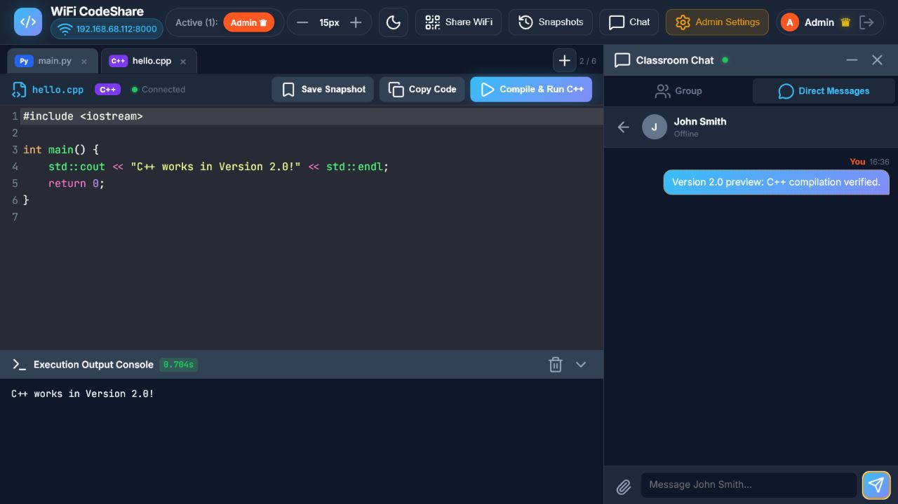
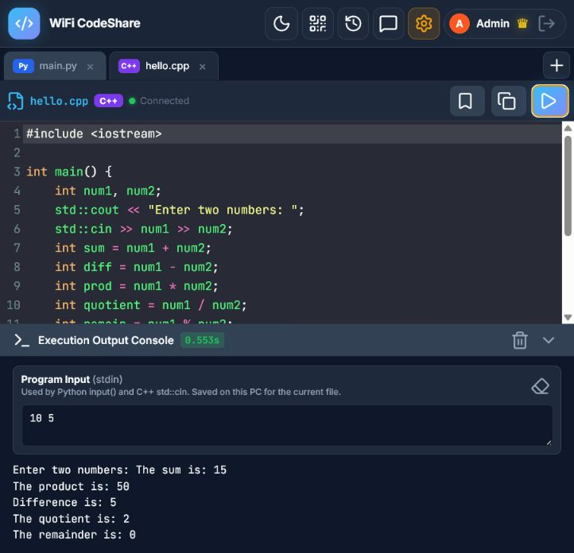

# Real-Time LAN Multiuser Code Editor

A real-time LAN code editor for Python and C++ with registered accounts,
multi-file collaboration, line ownership, access controls, live presence,
group chat, direct messages, snapshots, and server-side code execution.



## Version

This repository represents **Version 2.0 — Registered Accounts, Multi-File
Workspace and Messaging**.

Version 2.0 is a major Rapid Application Development milestone adding
registered identities, multi-file Python/C++ collaboration, granular code
permissions, program input, and improved messaging.

For a detailed explanation of additions, replacements, fixes, security notes,
and earlier milestones, read the [changelog](CHANGELOG.md).

> [!WARNING]
> **Use Version 2.0 only on a trusted host computer and trusted local network.**
> It is intended for a small class, lab, or study group working together with
> or without their lecturer. A group working without a lecturer must designate
> one trusted member as the Admin. Do not deploy this version to the public
> internet. Student names, Student IDs, dates of birth, code, chats, snapshots,
> ownership records, and permissions are stored locally as readable JSON files
> in the host's `data` folder. The application has no cloud synchronization and
> does not intentionally upload these records online, but they can be exposed
> if the server is made public or if a populated `data` folder is uploaded to
> GitHub, cloud storage, or another service. Never publish real class data.

## University-friendly controlled access

Before a student can sign in, their identity must be pre-registered by the
lecturer acting as Admin. The record contains the student's full name, Student
ID, date of birth, and optional class information. A student can enter the
workspace only when their login details match an active record.

This controlled-enrolment workflow prevents anonymous self-registration and
associates collaborative activity with a known class member. It can also be
used by a small independent study group when one trusted member manages the
records through the Admin account.

> [!IMPORTANT]
> This is a university-friendly prototype, not official university identity
> authentication. It is not connected to institutional SSO, Active Directory,
> or a protected student database. The shared testing password and readable
> JSON records must be replaced with individual password hashing, encrypted
> storage, HTTPS, a database, and institutional authentication before any
> production or campus-wide deployment.

## Main features

- Controlled student records managed by a trusted Admin
- Real-time multi-file Python and C++ collaboration over a LAN
- Persistent line ownership, blank-line claiming, and code-access permissions
- Python and C++ execution with per-file Program Input (`stdin`)
- Live presence, collaborative cursors, and restorable code snapshots
- Group chat and improved direct messaging with unread alerts
- LAN/QR sharing, light and dark themes, and adjustable editor text

See the [changelog](CHANGELOG.md) for the complete Version 2.0 feature list and
detailed changes from earlier versions.

## C++ compiler requirements

C++ files can be edited on any connected device, but compilation happens on the
host computer running `python app.py`. Students do not need to install a
compiler on their own devices.

Version 2.0 automatically searches the host for:

1. `g++`
2. `clang++`
3. A compatible compiler path supplied through `LIVE_EDITOR_CPP_COMPILER`

Version 2.0 was tested successfully on the project computer using **g++**. It
compiled and ran a C++17 program through the authenticated application API.

Check whether a supported compiler is available from Windows Command Prompt:

```cmd
g++ --version
```

or:

```cmd
clang++ --version
```

If neither command works, install either g++ or clang++ on the host computer,
add it to `PATH`, close and reopen Command Prompt, and start the server again.
You can also provide an explicit executable path for the current CMD session:

```cmd
set "LIVE_EDITOR_CPP_COMPILER=C:\path\to\g++.exe"
python app.py
```

An arbitrary compiler is not guaranteed to work. The current compile command
uses GCC/Clang-style options such as `-std=c++17`, `-O0`, and `-o`. Microsoft
Visual C++ `cl.exe` uses different options and is not supported without a code
change.

## Program input (`stdin`)

Programs that use Python `input()` or C++ `std::cin` need values before they
run. Enter those values in the **Program Input (stdin)** box above the output
console, then select **Run Python** or **Compile & Run C++**.



For example, this C++ statement:

```cpp
std::cin >> num1 >> num2;
```

can use either of these input formats:

```text
10 5
```

or:

```text
10
5
```

The input is limited to 20,000 characters and is saved in the current browser
for each file. It is not synchronized with other participants and is not saved
in the host's classroom data files. This allows each participant to test the
same shared code with different input values.

## Installing Python libraries

Python standard-library modules such as `math`, `json`, `statistics`, and
`collections` work without an additional installation. A third-party package
must be installed on the host computer into the same Python environment used
to start the server. Connected participants do not install it on their own
devices.

From the activated project environment in Windows Command Prompt:

```cmd
python -m pip install package-name
python app.py
```

For example:

```cmd
python -m pip install humanize
python app.py
```

Then a program can use:

```python
import humanize

print(humanize.intcomma(1234567))
```

Version 2.0 was tested by installing `humanize 4.16.0` in a disposable virtual
environment and importing it through the authenticated runner. The package was
removed with the test environment afterward and is not a project dependency.

Stop the server with `Ctrl+C` before changing its Python environment, install
only packages you trust, and restart the server afterward. Do not run `pip`
from student code. Packages installed only with `--user` may not be visible
because Python execution uses isolated mode; an activated virtual environment
is recommended.

### Import limitations

- Standard-library modules and compatible packages installed in the server's
  Python environment work.
- Separate Python tabs are independent documents in Version 2.0. A tab such as
  `helpers.py` cannot yet be imported from `main.py`.
- C++ standard-library headers such as `<iostream>`, `<vector>`, and
  `<algorithm>` work with the configured compiler.
- Third-party C++ libraries that require include paths, library paths, or
  linker flags are not automatically supported by the fixed compile command.
- GUI applications, hardware-specific packages, and packages requiring extra
  operating-system components may need additional host configuration.

## Technology

- Python
- FastAPI
- Uvicorn
- WebSockets
- HTML, CSS and JavaScript
- CodeMirror 5
- Lucide icons
- QRCode and Pillow
- g++ or clang++ for C++17 compilation

## Project structure

```text
.
├── app.py
├── requirements.txt
├── test_app.py
├── data/
│   ├── access_control.json
│   ├── chat_history.json
│   ├── code_state.json
│   ├── file_line_authors.json
│   ├── line_authors.json
│   ├── snapshots.json
│   ├── students.json
│   └── workspace_state.json
├── docs/
│   └── images/
└── static/
    ├── app.js
    ├── index.html
    └── style.css
```

The committed JSON files contain only clean demonstration data. Before sharing
a working copy, inspect every file in `data` and remove real student records,
messages, code, snapshots and identifiers.

## Run locally

1. Create and activate a virtual environment.

   **Windows Command Prompt**

   ```cmd
   python -m venv .venv
   .venv\Scripts\activate.bat
   ```

   **macOS or Linux**

   ```bash
   python3 -m venv .venv
   source .venv/bin/activate
   ```

2. Install the dependencies.

   ```cmd
   python -m pip install -r requirements.txt
   ```

3. If C++ execution is required, install and verify g++ or clang++ as described
   in [C++ compiler requirements](#c-compiler-requirements).

4. Start the application.

   ```cmd
   python app.py
   ```

5. Open `http://localhost:8000` on the host computer. Other participants on the
   same trusted LAN can open the Wi-Fi address printed in CMD or scan the QR code
   displayed by the application.

## Demonstration accounts

Use only the fictional records included with this public release.

### Admin

- Password: `12345`

### Student: John Smith

- Student ID: `ST001`
- Date of birth: `15/06/2005` (`2005-06-15` in the login date field)
- Password: `test1`

### Student: Bob

- Student ID: `ST002`
- Date of birth: `01/01/2005` (`2005-01-01` in the login date field)
- Password: `test1`

These are temporary demonstration passwords. Do not use them for real student
accounts.

## Change the testing passwords

Version 2.0 reads its passwords from environment variables. Set them in the
same Windows Command Prompt session before starting the server:

```cmd
set "LIVE_EDITOR_ADMIN_PASSWORD=choose-a-new-admin-password"
set "LIVE_EDITOR_STUDENT_PASSWORD=choose-a-new-shared-student-password"
python app.py
```

This is better than editing the source, but the student password is still
shared by every student in Version 2.0. Proper individual authentication must
be added before production use.

## Stop the server safely

1. Return to the CMD window where `python app.py` is running.
2. Press `Ctrl+C` once.
3. Wait for the normal command prompt to return.
4. Close CMD if it is no longer needed.

Code, messages, snapshots, student records, ownership and access settings are
normally saved when each change occurs. Active connections, cursor positions,
selections, typing indicators and in-memory login sessions are temporary.
Closing CMD during a JSON write or while the latest edit is still being sent
can lose data, so `Ctrl+C` is safer than closing the window directly.

## Mobile access (experimental)

A phone on the same trusted Wi-Fi can open the LAN address or scan the QR code.
Do not use `localhost` on the phone because that refers to the phone itself.
Version 2.0 is not fully optimized for small screens; Desktop site mode and
landscape orientation may provide a better temporary layout.

## After upgrading

Stop and restart the Python server after replacing files. Then hard-refresh the
browser so it does not use older cached JavaScript or CSS:

- Windows or Linux: `Ctrl+F5`
- macOS: `Cmd+Shift+R`

## Testing

The test suite uses isolated temporary data and does not modify the committed
demonstration records. Stop the live server, then run:

```cmd
python test_app.py
```

The suite checks authentication, student management, session enforcement,
multi-file tabs, line ownership, access grants, chat, snapshots, Python
execution, Python control flow/functions/classes/imports, Python/C++ standard
input, input-size limits, and C++ functions/loops/STL compilation when a
supported compiler is available.

## Security

Participants can execute Python and C++ programs on the host computer. Use this
prototype only with people you trust, on a trusted machine and isolated local
network. Do not port-forward it, deploy it to a public server, or expose it to
the public internet. Never use real student records in a public repository.

## Credits

The project began as a Rapid Application Development demonstration. Early
feature ideas were shaped through classroom discussions and feedback.

Version 2.0 combines later feedback-driven work on registered identities,
multi-file collaboration, access control, resizable settings and focused direct
messaging. Its public-history preparation removes private runtime data.

## Licence

No open-source licence has been selected. Reuse or redistribution requires
permission from the respective contributors.
