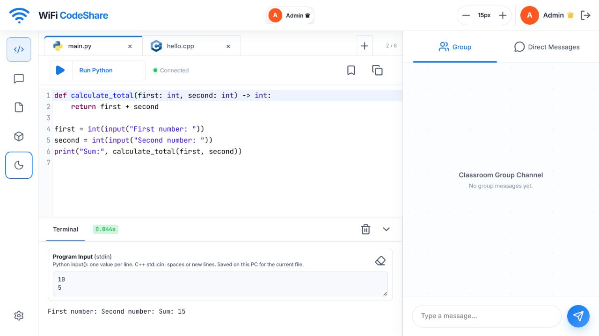
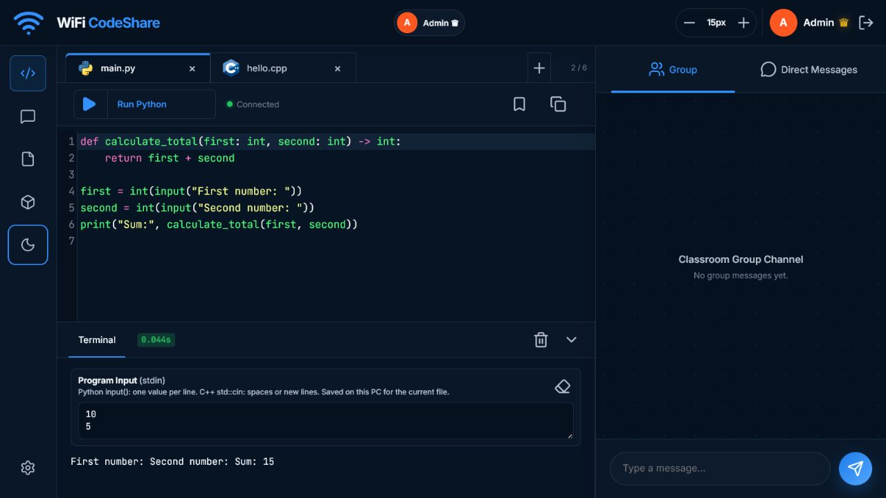
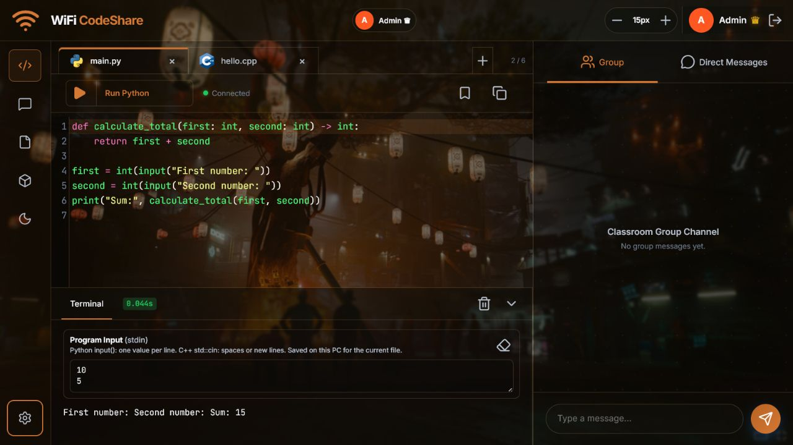

# Real-Time LAN Multiuser Code Editor

A real-time LAN code editor for Python and C++ with registered accounts,
collaborative editing, line ownership, access controls, messaging, personalized
appearance, snapshots, and server-side code execution.

## Version 3.0 — Major Interface and Appearance Update

Version 3.0 introduces a full-screen adjustable workspace, redesigned light and
dark themes, per-PC wallpapers, Fill/Fit layouts, adaptive colours, a blurred
ambient background, and improved message management.

For the complete release history, detailed changes, security guidance, privacy
information, and known limitations, read the [changelog](CHANGELOG.md).

> [!WARNING]
> **Use Version 3.0 only on a trusted host computer and trusted local network.**
> It is intended for a small class, lab, or study group working together with
> or without a lecturer. Do not expose it to the public internet or publish a
> populated `data` folder. Names, Student IDs, dates of birth, code, chats,
> snapshots, ownership records, and permissions are stored locally as readable
> JSON on the host computer. Never publish real class data.

Registered students must be added by the lecturer acting as Admin, or by a
trusted Admin in an independent study group. Students can enter only when their
Student ID, date of birth, and password match an active record.

> [!IMPORTANT]
> This is a university-friendly prototype, not official university identity
> authentication. It is not connected to institutional SSO, Active Directory,
> or a protected student database. Individual password hashing, encrypted
> storage, HTTPS, a database, stronger execution isolation, and institutional
> authentication are required before production or campus-wide use.

### Default light theme



### Default dark theme



### Dark theme with a fitted wallpaper



The wallpaper example uses **Fit**, **5% background dimming**, **98% wallpaper
visibility**, and **2px panel blur**. Wallpaper images and appearance settings
are saved only in the current browser on that PC and are not synchronized.

## Main features

- Admin-managed student records and one active session per student
- Real-time multi-file Python and C++ collaboration over a LAN
- Persistent line ownership, blank-line claiming, and code-access permissions
- Python and C++ execution with per-file Program Input (`stdin`)
- Live presence, collaborative cursors, and restorable code snapshots
- Group Chat and Direct Messages with editing, deletion, and unread alerts
- Adjustable workspace, terminal, chat, and Admin Settings panels
- Light, dark, and automatic themes with locally saved wallpapers
- Fill/Fit wallpaper layouts, adaptive colours, and ambient backgrounds
- LAN address and QR-code sharing for trusted devices

## Quick start

### 1. Create an environment

Windows Command Prompt:

```cmd
python -m venv .venv
.venv\Scripts\activate.bat
```

macOS or Linux:

```bash
python3 -m venv .venv
source .venv/bin/activate
```

### 2. Install dependencies

```cmd
python -m pip install -r requirements.txt
```

### 3. Start the server

```cmd
python app.py
```

Open `http://localhost:8000` on the host computer. Other trusted devices on the
same LAN can use the Wi-Fi address shown in CMD or scan the displayed QR code.

## Demonstration accounts

Use only these fictional demonstration records.

| Role/User | Student ID | Date of birth | Password |
|---|---|---|---|
| Admin | — | — | `12345` |
| John Smith | `ST001` | `15/06/2005` (`2005-06-15` in the login field) | `test1` |
| Bob | `ST002` | `01/01/2005` (`2005-01-01` in the login field) | `test1` |

These passwords are temporary. Change them before using the project with a
private group.

### Change the testing passwords

Set different passwords in the same CMD window before starting the server:

```cmd
set "LIVE_EDITOR_ADMIN_PASSWORD=choose-a-new-admin-password"
set "LIVE_EDITOR_STUDENT_PASSWORD=choose-a-new-shared-student-password"
python app.py
```

The Student password remains shared by all registered students in Version 3.0.

## Program Input (`stdin`)

Enter input in the **Program Input (stdin)** box before running a file. Input is
limited to 20,000 characters and saved separately for each file in the current
browser. It is not synchronized with other participants.

### Python input

For separate Python `input()` calls, only the one-value-per-line format works:

```text
10
5
```

Entering `10 5` on one line gives the first `input()` call the complete text
`10 5`, so converting it directly with `int()` fails.

### C++ input

C++ `std::cin` accepts either:

```text
10 5
```

or:

```text
10
5
```

## C++ compiler

C++ compilation happens on the host computer. Connected participants do not
need their own compiler.

Version 3.0 searches for `g++`, then `clang++`, then a compatible executable
provided through `LIVE_EDITOR_CPP_COMPILER`. Check the host from CMD:

```cmd
g++ --version
clang++ --version
```

To provide a compiler path manually:

```cmd
set "LIVE_EDITOR_CPP_COMPILER=C:\path\to\g++.exe"
python app.py
```

The project was tested successfully with `g++` using C++17. Microsoft `cl.exe`
is not currently supported because it uses different command options.

### C++ libraries

Standard C++ headers work with the configured compiler, including:

```cpp
#include <iostream>
#include <vector>
#include <algorithm>
#include <string>
```

> [!IMPORTANT]
> Third-party C++ libraries are not automatically supported when they require
> additional include paths, library paths, linker flags, or multi-file builds.
> The current runner compiles one source file using fixed GCC/Clang-style C++17
> options.

## Python libraries

Standard-library modules such as `math`, `json`, `statistics`, and `collections`
work automatically. Install trusted third-party packages into the same Python
environment used to start the server:

```cmd
python -m pip install package-name
python app.py
```

For example:

```cmd
python -m pip install humanize
```

Version 3.0 successfully imported `humanize 4.16.0` through the authenticated
runner during testing.

Important library behaviour:

- Stop the server with `Ctrl+C` before changing its Python environment.
- Install packages only from the host CMD, never from student code.
- Separate Python tabs cannot currently import one another.
- Packages installed only with `--user` may not be visible; use the activated
  virtual environment.
- GUI, hardware-specific, and operating-system-dependent packages may require
  additional host configuration.

## Testing

Version 3.0 passed:

- **12/12 permanent automated tests**
- **12/12 Python/C++ execution-matrix tests**
- Real C++17 compilation and execution using `g++`
- Third-party Python package installation and import testing
- Browser tests covering login, execution, settings, and both themes

Run the isolated tests:

```cmd
python test_app.py
python test_execution_matrix.py
```

The test suites use temporary data and do not modify the committed demonstration
records.

## Stopping and upgrading

Stop the server safely by returning to CMD and pressing `Ctrl+C`. Code, messages,
snapshots, records, ownership, and permissions are normally saved when each
change occurs. Connections, cursor positions, selections, typing indicators,
and login sessions are temporary.

After replacing project files, restart the server and hard-refresh the browser:

- Windows or Linux: `Ctrl+F5`
- macOS: `Cmd+Shift+R`

## Mobile access

Phones on the same trusted Wi-Fi can use the LAN address or QR code. Do not use
`localhost` on a phone because it refers to the phone itself. Mobile support is
experimental; landscape orientation and **Desktop site** mode may provide a
better layout.

## Project structure

```text
.
├── app.py
├── requirements.txt
├── test_app.py
├── test_execution_matrix.py
├── data/
│   ├── students.json
│   ├── workspace_state.json
│   ├── file_line_authors.json
│   ├── access_control.json
│   ├── chat_history.json
│   ├── snapshots.json
│   ├── code_state.json
│   └── line_authors.json
├── docs/
│   └── images/
└── static/
    ├── app.js
    ├── index.html
    ├── style.css
    └── icons/
```

## Technology

Python, FastAPI, Uvicorn, WebSockets, HTML, CSS, JavaScript, CodeMirror 5,
Lucide icons, QRCode, Pillow, and a supported C++ compiler.

## Credits

The project began as a Rapid Application Development demonstration. Its
features developed through classroom discussion, feedback, implementation, and
repeated testing.

## Licence

No open-source licence has been selected. Reuse or redistribution requires
permission from the respective contributors.
