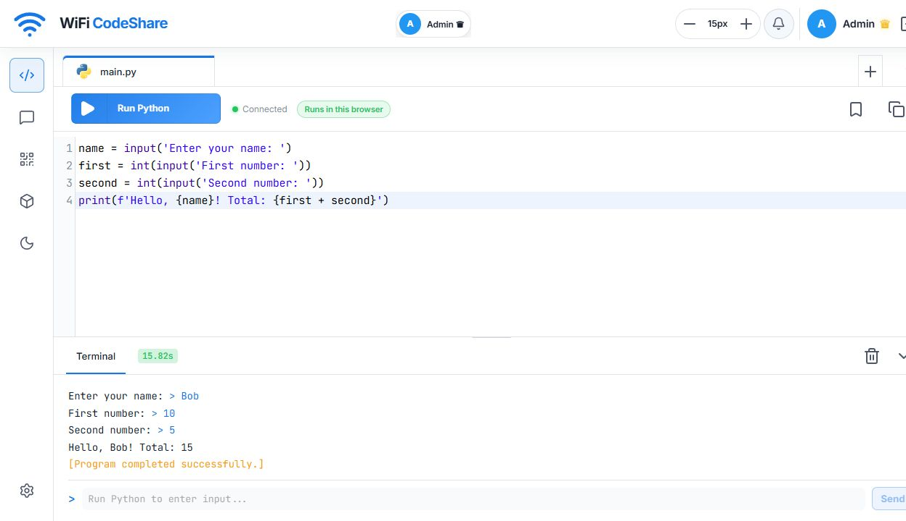
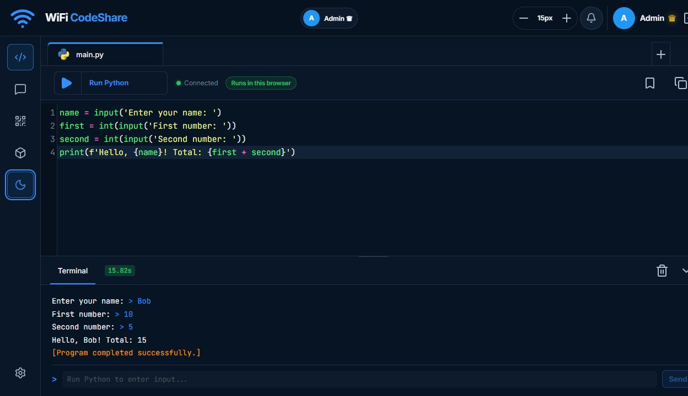
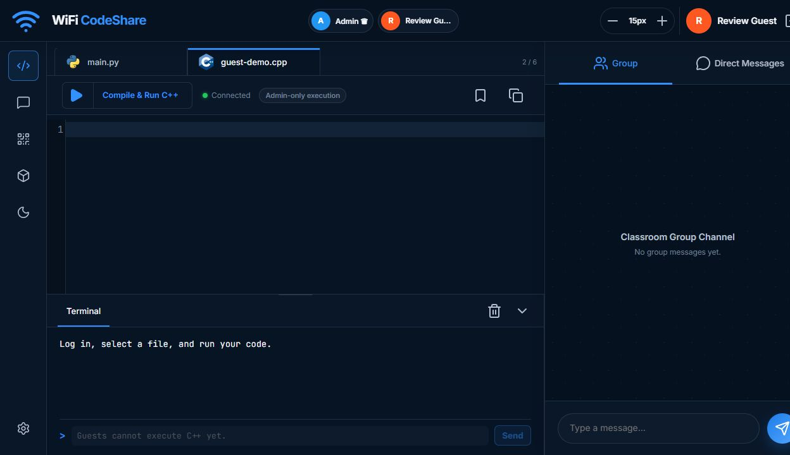

# Real-Time LAN Multiuser Code Editor

A real-time LAN code editor for Python and C++ with collaborative editing,
line ownership, Admin-approved Guest access, chat, appearance controls, and
safer split execution. Python runs inside each participant's browser, while
only the Admin can execute C++ on the trusted host. Changes, presence,
messages, permissions, and file updates are synchronized in real time.

## Version 5.0 — Browser Python and Admin-Only C++

Version 5.0 removes server-side Python execution. Admins and Guests run Python
3.14 in a dedicated Pyodide WebAssembly worker on their own browser, including
interactive terminal input and Stop control. The pinned runtime is served by
the LAN host, so connected devices do not need Python, Docker, or a separate
runner installed.

C++ remains a host feature temporarily. The Admin can compile, run, stop, and
enter C++ terminal input. Guests may create and collaboratively edit C++ files,
but their Run button is disabled. Both the REST compatibility route and live
WebSocket enforce the same rule, so hiding the button is not the security
boundary.

Read the [changelog](CHANGELOG.md) for the complete feature history, detailed
changes, security notes, and previous releases.

> [!WARNING]
> **Use this project only on a trusted host computer and trusted local network.**
> It is intended for a class, lab, or small group working together with or
> without a lecturer. Do not expose the development server to the public
> internet or publish a populated `data` folder. Guest names, code, chats,
> snapshots, ownership, and permissions are stored locally as readable JSON.

> [!IMPORTANT]
> This is a collaborative prototype, not production authentication. It does
> not provide HTTPS, university SSO, or encrypted storage. Browser Python is
> isolated from the host operating system, but Admin C++ still executes on the
> host without a complete sandbox. Keep the Admin account trusted.

### Version 5.0 light theme and browser Python terminal



### Version 5.0 dark theme and browser Python terminal



### Guest C++ editing with execution disabled



All screenshots above were captured from the working Version 5.0 feature
branch. Submitted terminal input is blue, successful status messages are
yellow, and red remains reserved for errors and failed limits.

## Main features

- Live FIFO Admin approval or rejection of Guest join requests from a bell
  popover or Admin Settings
- Real-time multi-file Python and C++ collaboration over a LAN
- Persistent line ownership, blank-line claiming, and code-access permissions
- Up to 15 Admin-configurable Python and C++ file tabs
- Browser-side Python 3.14 with interactive input, output limits, Stop control,
  and no access to the host operating system
- Admin-only host C++17 execution with Guest C++ collaboration kept editable
- Group Chat and Direct Messages with unread alerts, editing, and deletion
- One active session per approved Guest and Admin removal controls
- Adjustable full-screen workspace, terminal, chat, and Admin Settings panels
- Light, dark, and automatic themes with local wallpapers, Fill/Fit, adaptive
  colours, panel blur, dimming, visibility, and ambient backgrounds
- LAN address and QR-code sharing for trusted devices

## Quick start

### 1. Create an environment

Windows Command Prompt:

```cmd
python -m venv .venv
.\.venv\Scripts\activate.bat
```

macOS or Linux:

```bash
python3 -m venv .venv
source .venv/bin/activate
```

### 2. Install dependencies

```cmd
python -m pip install -r requirements.txt
```

### 3. Start the server

```cmd
python app.py
```

Open `http://localhost:8000` on the host. Trusted devices on the same LAN can
open the Wi-Fi address shown in CMD or scan the displayed QR code.

The Python WebAssembly runtime is served locally by this project. The current
interface still loads CodeMirror, Lucide icons, Google Fonts, and QRCode from
public CDNs, so an internet connection is currently needed for the complete
interface on its first load. Fully offline LAN support is not finished yet.

## Demonstration login

1. Select **Admin**, enter password `12345`, and log in.
2. On another browser or device, select **Guest**, enter a fictional full name
   such as `Bob`, choose a cursor colour, and send the request.
3. The Admin receives `Bob wants to join`. Open the bell popover or go to
   **Admin Settings → Join Requests**, then select **Accept** or **Reject**.
   When several Guests are waiting, resolve the oldest request first; the next
   request receives the controls automatically.
4. An accepted Guest enters automatically. Their approved identity is retained
   for future requests, and the Admin can remove it from Settings.

Only one active connection is allowed for each approved Guest identity.

### Change the Admin password

Set a private password in the same CMD window before starting the server:

```cmd
set "LIVE_EDITOR_ADMIN_PASSWORD=choose-a-new-admin-password"
python app.py
```

This is safer than editing the default value in `app.py` and avoids committing
a personal password to GitHub.

## Running Python in the browser

Admins and approved Guests can select **Run Python**. The first run loads the
approximately 13.5 MB local WebAssembly runtime from the LAN host; later runs
reuse the worker while the page remains open. When the program requests a
value, type it in the terminal row and press `Enter` or select **Send**.

For separate Python `input()` calls, send one value at each prompt:

```text
10
5
```

Entering `10 5` on one line gives the first Python `input()` call the complete
text. The browser worker replays the isolated program with the collected input
values whenever another value is submitted. This supports ordinary learning
programs, loops, functions, and classes, but nondeterministic code may produce
a different earlier value during a replay. Select **Stop** to destroy the
worker immediately.

Browser Python limits are 60 seconds per run, 100,000 output characters, 4,096
characters per input line, and 20,000 input characters per run.

## Running C++ as Admin

Only the Admin can select **Compile & Run C++** or send C++ terminal input.
Guests can still open, create, and collaboratively edit C++ files, but the Run
button displays **Admin-only execution** and remains disabled. This temporary
restriction prevents Guest code from executing operating-system commands on
the Admin computer.

C++ `std::cin` accepts either `10 5` on one line or values on separate lines.
Host safeguards remain 60 seconds per run, 100,000 output characters, one
active Admin run, and up to four simultaneous compiler processes.

## C++ compiler and libraries

C++ compilation happens on the Admin host; connected Guests do not need their
own compiler because they cannot execute C++ in this version. The runner
searches for `g++`, then `clang++`, and uses C++17. It was tested with `g++`.
Check the host from CMD:

```cmd
g++ --version
clang++ --version
```

To configure a compatible compiler executable manually:

```cmd
set "LIVE_EDITOR_CPP_COMPILER=C:\path\to\g++.exe"
python app.py
```

Microsoft `cl.exe` is not currently supported because it requires different
command options. Standard headers such as `<iostream>`, `<vector>`,
`<algorithm>`, and `<string>` work with the configured compiler.

> [!IMPORTANT]
> Third-party C++ libraries that need extra include paths, library paths,
> linker flags, or multi-file builds are not automatically supported. The
> current runner compiles one source file with fixed GCC/Clang-style options.

## Python libraries

Python standard-library imports work inside the browser runtime, including
modules such as `math`, `json`, `statistics`, and `collections`. Packages
installed in the host virtual environment are intentionally **not** visible to
browser Python. Third-party Pyodide package files are not bundled yet, and
separate Python workspace tabs cannot currently import one another.

## Testing

Version 5.0 passed **20/20 permanent automated tests** and **12/12 execution-
matrix checks**. Eight matrix checks run against the real pinned Pyodide engine
and cover browser isolation, interactive input, imports, loops, functions,
recursion, classes, errors, and output limits. Four checks verify Admin C++17
STL compilation, input, compiler errors, and timeouts. Live Admin and Guest
browser tests also completed without console errors.

```cmd
python test_app.py
python test_execution_matrix.py
node test_browser_python.mjs
```

The server tests use isolated temporary data and do not modify committed
records. The Node check loads the same local WebAssembly runtime used by the
browser and does not start the application server.

## Stopping, upgrading, and mobile access

Stop the server by returning to CMD and pressing `Ctrl+C`. Persistent changes
are normally saved when they happen; live connections, cursors, typing state,
and login sessions end when the server stops.

After upgrading, restart the server and hard-refresh the browser with `Ctrl+F5`
(Windows/Linux) or `Cmd+Shift+R` (macOS).

Phones on the same trusted Wi-Fi can use the LAN address or QR code. Do not use
`localhost` on a phone. Mobile support remains experimental; landscape
orientation and **Desktop site** mode usually provide a better layout.

## Project structure

```text
.
├── app.py
├── requirements.txt
├── test_app.py
├── test_browser_python.mjs
├── test_execution_matrix.py
├── data/                    # Local JSON workspace and collaboration state
├── docs/
│   └── images/             # Release screenshots
└── static/
    ├── python-runtime.mjs   # Browser Python execution and input replay
    ├── python-worker.mjs    # Disposable Web Worker controller
    └── vendor/pyodide/      # Pinned local Pyodide 314.0.5 runtime
```

## Technology

Python, FastAPI, Uvicorn, WebSockets, HTML, CSS, JavaScript, CodeMirror 5,
Pyodide 314.0.5, WebAssembly, Web Workers, Lucide icons, QRCode, Pillow, and a
supported C++ compiler.

## Credits

The project began as a Rapid Application Development demonstration. Its
features developed through classroom discussion, feedback, implementation,
and repeated testing.

## Licence

No open-source licence has been selected. Reuse or redistribution requires
permission from the respective contributors. The vendored Pyodide runtime is
separately licensed under the Mozilla Public License 2.0; its licence is kept
in `static/vendor/pyodide/LICENSE`.
