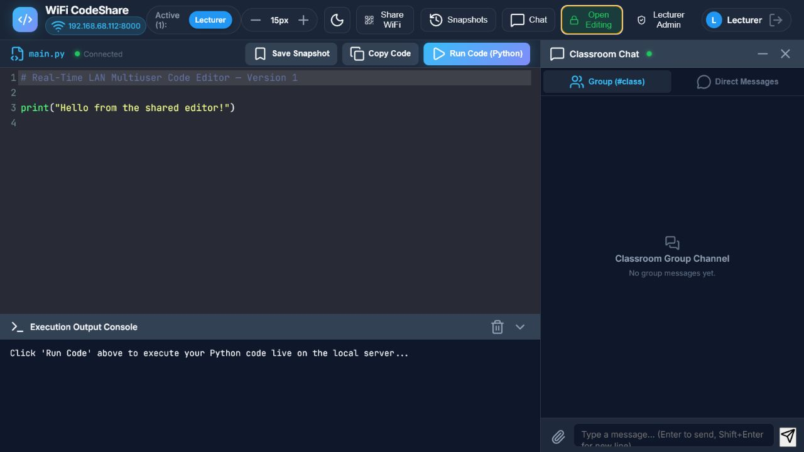

# Real-Time LAN Multiuser Code Editor

A real-time LAN code editor for Python with synchronized multiuser editing,
live presence, chat, snapshots, and server-side code execution—all updated live
for connected users.



## Version

This repository represents **Version 1.2 — Blank-Line Claiming and Permission
Modes**.

Version 1.2 builds on line ownership by keeping blank lines open for any user
and giving the Lecturer a synchronized class-wide choice between Restricted
and Open Editing. Later releases document each addition, modification, and
removal through the public changelog.

For a detailed explanation of new features, fixes, changes, and historical
notes, read the [changelog](CHANGELOG.md).

## What's new in Version 1.2

- Blank lines remain unclaimed and can be used by any participant
- Writing on a blank line automatically claims its non-empty content
- Clearing a line releases its ownership for another participant
- Restricted mode preserves per-line creator protection
- Open Editing mode temporarily allows everyone to edit any line
- A global permission control is shown to the participant using the Lecturer
  role and synchronizes the selected mode for all connected users
- The current permission mode is saved between server restarts

## Features

- Real-time shared Python editor over a local Wi-Fi or Ethernet network
- Live user presence, cursor positions, selections, and typing activity
- Per-line ownership and read-only editing permissions
- Restricted and class-wide Open Editing permission modes
- Live active-line highlights and creator tooltips
- Exclusive cursor-colour selection for connected users
- Python execution with standard output and error reporting
- Group chat and private direct messages
- Direct-message notifications and unread indicators
- Resizable and collapsible chat panel
- Named code snapshots with restore support
- Light and dark editor themes
- Adjustable editor font size
- QR code and LAN address sharing
- A PIN-gated Lecturer Admin panel for managing the allowed username list
  (demonstration protection only)
- Responsive interface for laptops, tablets, and phones

## Technology

- Python
- FastAPI
- Uvicorn
- WebSockets
- HTML, CSS, and JavaScript
- CodeMirror 5
- Lucide icons
- QRCode and Pillow

## Project structure

```text
.
├── app.py
├── requirements.txt
├── test_app.py
├── data/
│   ├── chat_history.json
│   ├── code_state.json
│   ├── line_authors.json
│   ├── permission_mode.json
│   ├── snapshots.json
│   └── users.json
├── docs/
│   └── images/
└── static/
    ├── app.js
    ├── index.html
    └── style.css
```

The committed JSON files contain only clean demonstration data. Do not publish
real messages, saved code, snapshots, or identifying user records.

## Run locally

1. Create and activate a virtual environment.

   **Windows Command Prompt**

   ```cmd
   python -m venv .venv
   .venv\Scripts\activate.bat
   ```

   **macOS or Linux**

   ```bash
   python3 -m venv .venv
   source .venv/bin/activate
   ```

2. Install the dependencies.

   ```bash
   python -m pip install -r requirements.txt
   ```

3. Start the application.

   ```bash
   python app.py
   ```

4. Open `http://localhost:8000` on the host computer. Other users on the same
   trusted LAN can open the Wi-Fi address printed in the terminal or scan the
   QR code from the application.

## Stop the server safely

1. Return to the Command Prompt window where `python app.py` is running.
2. Press `Ctrl+C` once.
3. Wait for the server to finish stopping and return to the normal command
   prompt.
4. Close the Command Prompt window if it is no longer needed.

Closing the Command Prompt window also stops the server, but `Ctrl+C` is safer.
Code, messages, snapshots, usernames, line ownership, and the permission mode
are normally saved when each change happens. Connected-user presence, cursor
positions, selections, and typing indicators are temporary and are not saved.
An edit that is still being transmitted at the exact moment of a sudden
shutdown may be lost, and closing the window during a JSON write may damage
that data file.

## Mobile access (experimental)

The editor can be opened on a phone connected to the same Wi-Fi network as the
host computer. Use the computer's LAN address, such as
`http://192.168.x.x:8000`, or scan the QR code shown by the application. Do not
use `localhost` on the phone because that refers to the phone itself.

Version 1.2 is not yet fully optimized for small mobile screens. For a more
usable temporary layout, enable **Desktop site** in the mobile browser and use
the phone in landscape orientation. Full mobile optimization is still in
progress.

## After upgrading

Stop and restart the Python server after replacing files. Then perform a hard
refresh so the browser does not continue using an older cached JavaScript or
CSS file:

- Windows or Linux: `Ctrl+F5`
- macOS: `Cmd+Shift+R`

If the old interface still appears, close that browser tab and open the LAN
address again.

## Version 1.2 demonstration access

- Choose a listed name or select the custom Guest option.
- Select an available cursor colour.

> [!IMPORTANT]
> **Important security notice — known Lecturer authentication issue:** During
> pre-release browser execution
> and testing of Version 1.2, we discovered that selecting **Lecturer** at the
> user-selection screen does not request or verify the user-management panel
> PIN. Further review confirmed that the same issue was also present in Versions
> 1 and 1.1. The PIN protects only the **Lecturer Admin** username-management
> panel; it does not authenticate the Lecturer role. Therefore, anyone on the
> trusted LAN can select Lecturer when that username is not already active.
> This historical behaviour is documented in Version 1.2 and should not be
> treated as secure authentication. Do not expose this version to an untrusted
> network or the public internet.

## Change the Lecturer Admin User-Management Panel PIN

This PIN unlocks only the Lecturer Admin user-management panel; it does not
protect Lecturer selection or authenticate the Lecturer role. Version 1.2
keeps the demonstration PIN in two files. The value must be changed in both
places so the browser and server continue to match.

1. Stop the running Python server.
2. Open the project folder, then open `data/users.json` in a text editor.
3. Find the following line:

   ```json
   "admin_pin": "1234"
   ```

4. Replace `1234` with the new PIN and save the file. For example:

   ```json
   "admin_pin": "5678"
   ```

5. Open `static/app.js` in a text editor.
6. Search for the following line:

   ```javascript
   if (pin === '1234') { // Default PIN
   ```

7. Replace `1234` with the same new PIN and save the file. For example:

   ```javascript
   if (pin === '5678') { // Default PIN
   ```

8. Restart the application with `python app.py`.
9. Hard-refresh the browser with `Ctrl+F5` on Windows or Linux, or
   `Cmd+Shift+R` on macOS.

This PIN is stored as readable text and can be seen in the browser's JavaScript.
It is only a temporary demonstration lock for a trusted LAN. Do not reuse a
personal, email, banking, or other important password.

## Testing

Testing is optional and is not required every time the editor starts. The test
script automatically checks that the following parts of the project work:

- LAN address detection and QR-code generation
- User-list and information APIs
- Server-side Python execution
- Snapshot creation and retrieval
- Duplicate-username protection
- Group chat, direct messages, and read-state events
- Line ownership, blank-line claiming, and ownership release
- Restricted/Open Editing modes and Lecturer synchronization

Stop the live server before running the tests, then use:

```bash
python test_app.py
```

Each successful check displays `[PASS]`. The final line should say:

```text
ALL BACKEND & WEBSOCKET VERIFICATION TESTS PASSED!
```

The script uses the project's demonstration JSON files and may update saved
code, chat, snapshot, ownership, or permission-mode data. Run it before adding
real session data, or make a backup copy of the `data` folder first.

## Current Version 1.2 limitations

- Libraries or packages cannot be uploaded or installed from the editor.
  Shared Python code can only import modules already installed on the host
  computer. A required package must be installed by the host administrator,
  normally with `python -m pip install package-name`, before the server starts.
- The chat attachment button does not upload or transfer a file in Version 1.2.
  It only adds the selected filename to the message field.
- Version 1.2 supports Python execution only. C++ editing and compilation are
  planned for a later version.
- Mobile access is experimental and is not yet optimized for small screens.

## Security

This prototype executes Python on the host computer and is not a complete
security sandbox. Use it only on a trusted machine and trusted local network.
The Lecturer role is not authenticated, and the user-management panel PIN is
readable in the project files. Do not expose this version directly to the
public internet.

## Credits

The original prototype was implemented by my lecturer with the help of an AI
coding agent as a Rapid Application Development demonstration. Early feature
ideas were shaped through discussions with me and feedback from my classmates.

This clean public-history preparation removes private runtime data while
preserving the behaviour of the original Version 1.2 application.

## Licence

No open-source licence has been selected. Reuse or redistribution requires
permission from the respective contributors.
