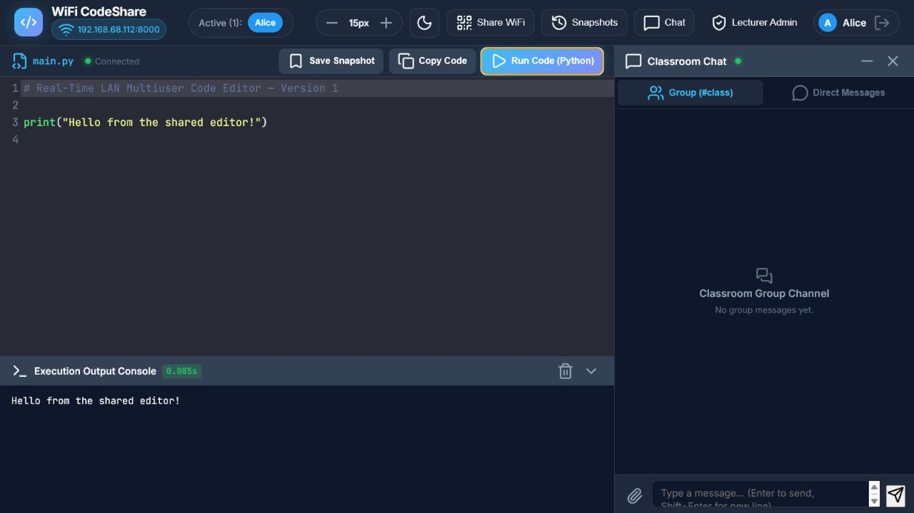

# Real-Time LAN Multiuser Code Editor

A real-time LAN code editor for Python with synchronized multiuser editing,
live presence, chat, snapshots, and server-side code execution—all updated live
for connected users.



## Version

This repository preview represents **Version 1 — Initial LAN Editor**.

Version 1 establishes the first working prototype. Later releases will document
the addition, modification, and removal of features through a public changelog.

## Features

- Real-time shared Python editor over a local Wi-Fi or Ethernet network
- Live user presence, cursor positions, selections, and typing activity
- Exclusive cursor-colour selection for connected users
- Python execution with standard output and error reporting
- Group chat and private direct messages
- Direct-message notifications and unread indicators
- Resizable and collapsible chat panel
- Named code snapshots with restore support
- Light and dark editor themes
- Adjustable editor font size
- QR code and LAN address sharing
- Lecturer controls for managing the allowed username list
- Responsive interface for laptops, tablets, and phones

## Technology

- Python
- FastAPI
- Uvicorn
- WebSockets
- HTML, CSS, and JavaScript
- CodeMirror 5
- Lucide icons
- QRCode and Pillow

## Project structure

```text
.
├── app.py
├── requirements.txt
├── test_app.py
├── data/
│   ├── chat_history.json
│   ├── code_state.json
│   ├── snapshots.json
│   └── users.json
├── docs/
│   └── images/
└── static/
    ├── app.js
    ├── index.html
    └── style.css
```

The committed JSON files contain only clean demonstration data. Do not publish
real messages, saved code, snapshots, or identifying user records.

## Run locally

1. Create and activate a virtual environment.

   **Windows Command Prompt**

   ```cmd
   python -m venv .venv
   .venv\Scripts\activate.bat
   ```

   **macOS or Linux**

   ```bash
   python3 -m venv .venv
   source .venv/bin/activate
   ```

2. Install the dependencies.

   ```bash
   python -m pip install -r requirements.txt
   ```

3. Start the application.

   ```bash
   python app.py
   ```

4. Open `http://localhost:8000` on the host computer. Other users on the same
   trusted LAN can open the Wi-Fi address printed in the terminal or scan the
   QR code from the application.

## Version 1 demonstration access

- Choose a listed name or select the custom Guest option.
- Select an available cursor colour.
- The temporary Lecturer Admin PIN is `1234`.

The PIN is a Version 1 development value, not secure production
authentication.

## Testing

Run:

```bash
python test_app.py
```

## Security

This prototype executes Python on the host computer and is not a complete
security sandbox. Use it only on a trusted machine and trusted local network.
Do not expose Version 1 directly to the public internet.

## Credits

The original prototype was implemented by my lecturer with the help of an AI
coding agent as a Rapid Application Development demonstration. Early feature
ideas were shaped through discussions with me and feedback from my classmates.

This clean public-history preparation removes private runtime data while
preserving the behaviour of the original Version 1 application.

## Licence

No open-source licence has been selected. Reuse or redistribution requires
permission from the respective contributors.
